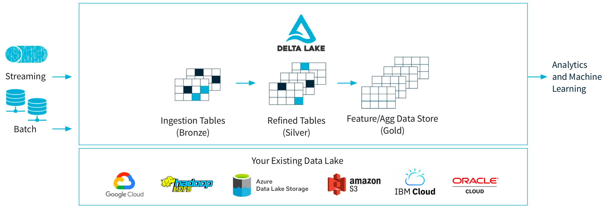

# Azure Data Engineer

> Looking for achitectures: https://learn.microsoft.com/en-us/azure/architecture/browse/

### Azure databricks Analytics architecture

### Pyspark Databricks
[API reference](https://spark.apache.org/docs/latest/api/python/reference/index.html)

[Overview](https://spark.apache.org/docs/latest/api/python/index.html)

### Play with Azure Storage Account
> [azure_adls.py](source%2Fazure_adls.py)

## Delta Lake - Data Lakehouse architecture
[Delta Lake](./resource/Delta-lake.pdf) is an open-source storage framework that enables building a
[Lakehouse architecture](./resource/Lakehouse_architecture.pdf) with compute engines including Spark, PrestoDB, Flink, Trino, and Hive and APIs for Scala, Java, Rust, and Python.

## Data Lakehouse architecture
Rerference: https://docs.delta.io/latest/index.html

- Handles all types of data
- Cheap cloud object storage 
- Uses open source format (Parquet)
- Support for all types of workloads 
- Ability to use BI tools directly 
- ACID support 
- History & Versioning 
- Better performance Simple architecture

## Project scope
- Databricks / Using SparkSQL, PySpark
- Hive metastore, on top of ADLS
- Azure Data Lake Storage Gen 2 (Storage Account)
- ETL Pipeline using Azure Data Factory
- Delta Lake (Lake House architecture), using delta table
- Unity Catalog 
- Key Vault

## Mini project with Unity Catalog

We don't need to specify managed location for Catalog, just for all schema in the catalog