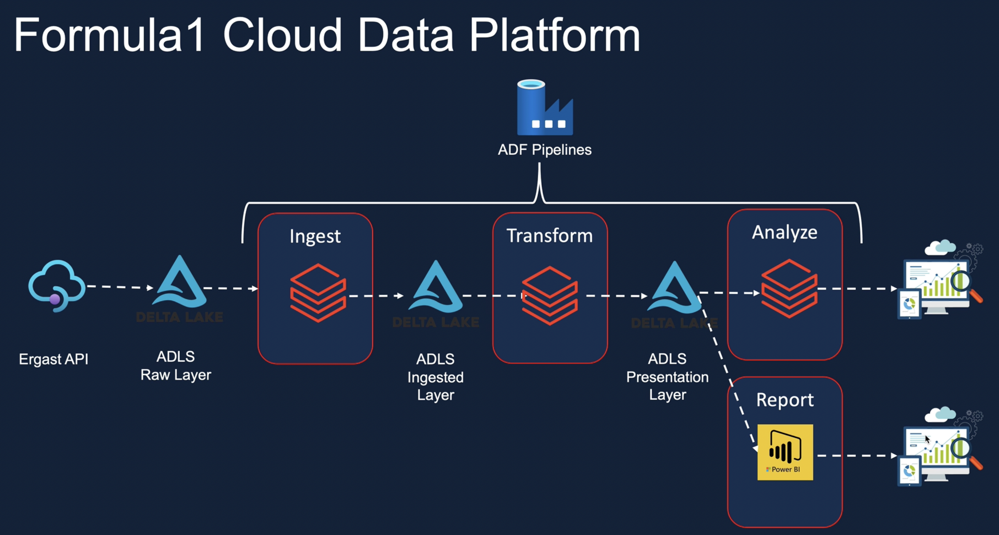
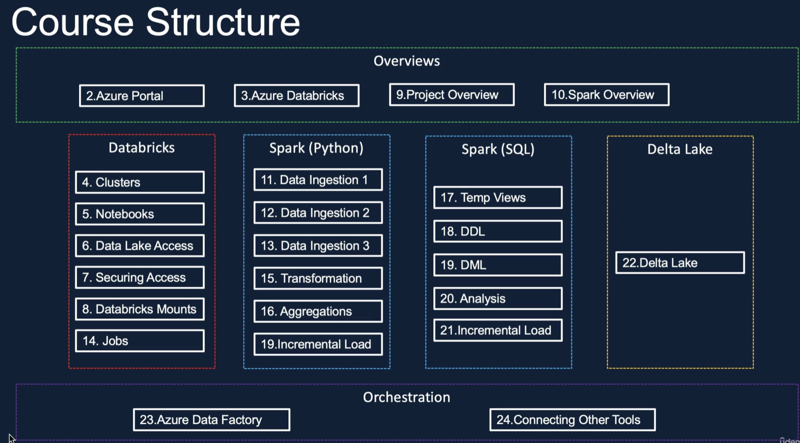
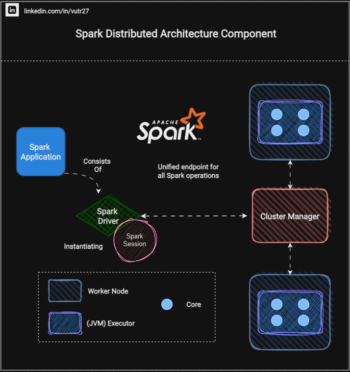
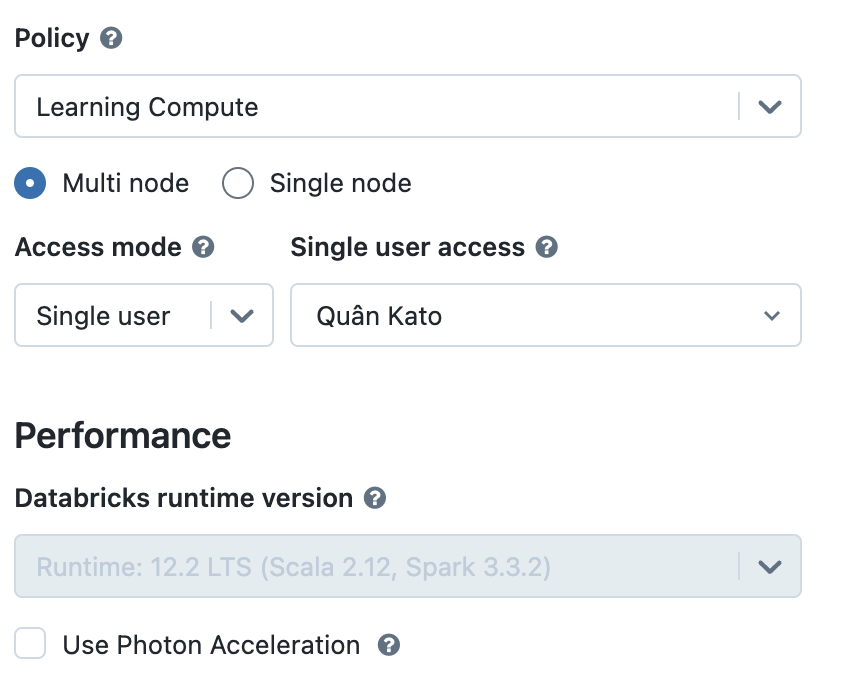

# Azure Databricks Overview
Azure Databricks is a cloud-based analytics platform that combines the power of Apache Spark with enhanced collaboration and management features.

<!-- TOC -->
* [Azure Databricks Overview](#azure-databricks-overview)
  * [Key Features:](#key-features)
  * [Project architecture](#project-architecture)
  * [Techstack using in this project](#techstack-using-in-this-project)
  * [Databricks Cluster](#databricks-cluster)
    * [Create Databricks Cluster](#create-databricks-cluster)
    * [Create budgets & Cost alerts](#create-budgets--cost-alerts)
<!-- TOC -->


## Key Features:

1. **Scalability:** Easily scale up or down to handle large datasets.

2. **Collaboration:** Collaborative workspace for data engineers, scientists, and analysts.

3. **Apache Spark Integration:** Supports Scala, Python, R, and SQL for distributed data processing.

4. **Managed Services:** Fully managed platform, handling infrastructure tasks.

5. **Unified Analytics:** Seamlessly transition between data engineering and data science tasks.

6. **Machine Learning:** Build, train, and deploy machine learning models at scale.

7. **Data Integration:** Ingest, transform, and analyze data from various sources.

8. **Security and Compliance:** Built-in security features and compliance support.
    
9. **Streaming Analytics:** Real-time data processing and streaming analytics.

10. **Visualization:** Create dashboards and visualize analysis results.

## Project architecture


## Techstack using in this project


Spark component


## Spark cheat sheet
[Cheat sheet](resource/PySpark_SQL_Cheat_Sheet.pdf)

## Databricks Cluster with Legacy Hive Metastore (Not Unity Catalog)
[Databricks pricing (by DBU)](https://azure.microsoft.com/en-us/pricing/details/databricks/)
Please use the following configuration for the databricks cluster.
```
Cluster Type - Single Node

Runtime version: LTS (Long-term support)

Node Type - Standard_D3s_v2
```
### Create Databricks Cluster
Databricks / Compute / Create compute (with below configuration):
- Policy: Unrestricted (Can create custom policy): [Cluster policy definitions](https://adb-1999765807836905.5.azuredatabricks.net/?o=1999765807836905#create/cluster) \
    For example: Set up value for spark version  with below policy config
    ```
    {
      "spark_version": {
        "type": "fixed",
        "value": "auto:latest-lts",
        "hidden": true  # to hide the version
      }
    }
  ```
- Access mode: No isolation shared
- Node type: Standard_DS3_v2 
- Termination time: 18 minutes (saving money for activity)
- Logging: dbfs:/cluster-logs/0821-080317-lq06a367

### Create budgets & Cost alerts
Budget Details
- Name: az-admin-exceed-30-pounds
- Reset period: Reset period
- Amount (Threshold): 10
Alert conditions:
- Actual - 90 (%) 
- Alert recipients (email): katoo2706@gmail.com


# Workflow / Jobs (Same as airflow)
Databricks workflow


Config task to link with notebook
