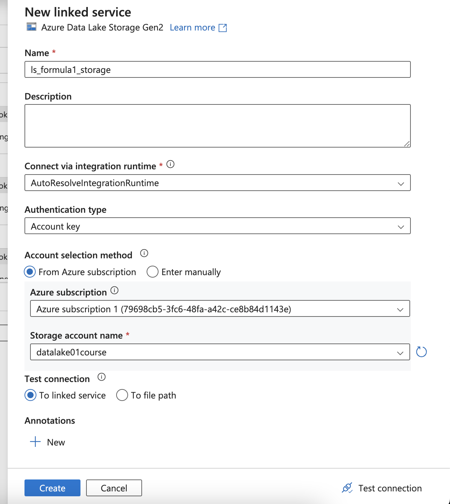
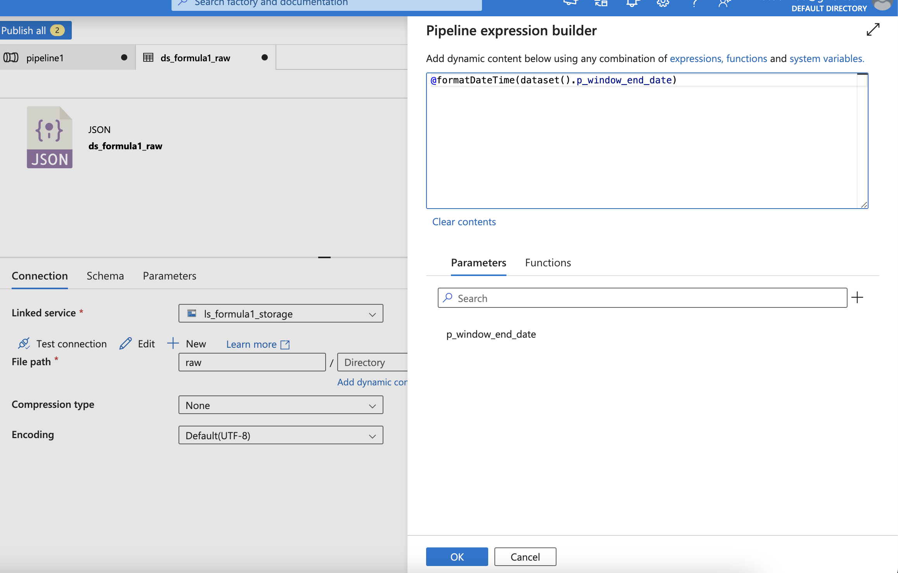

# Azure Data Factory
#### Learning resource:
- **Tutorial**: https://learn.microsoft.com/en-us/azure/data-factory/data-factory-tutorials
- **Video**: https://www.youtube.com/channel/UC2S0k7NeLcEm5_IhHUwpN0g/featured

#### Create CI/CD with git

Or after launching the Studio, choose Linked service and set up the git repo

Create pipeline

**Set up the linked Databrick Notebook**

To use Managed Service Identity
- Change access (IAM) in Azure Databricks Service - workspace
- Privileged Administrator Roles / Contributor

- Add menber etl-adls-course (Data Factory)

- After that, choose the access from existing cluster

*If it's not loaded, click other cluster and re-click the existing cluster for refresh UI*

- Add the dynamic parameters by using Variables from the pipeline

- Or using parameter (Can not be changed)

- Config the DAGs

#### Add Get metadata to check if file exists

| Set up the storage account                | Get parameter as directory                 |
|-------------------------------------------|--------------------------------------------|
|  |  |

**Check if data exists or not**

Then, click True (edit) and paste the Notebook into Window

#### Final: Create master execute pipeline
