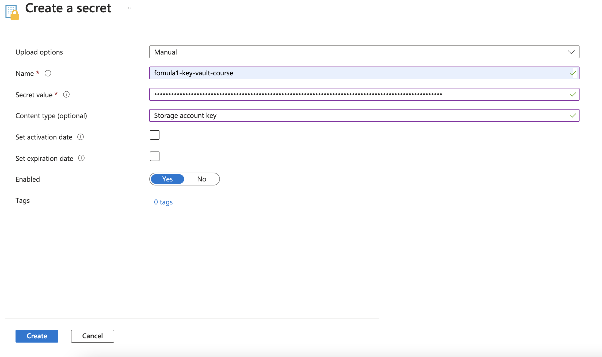
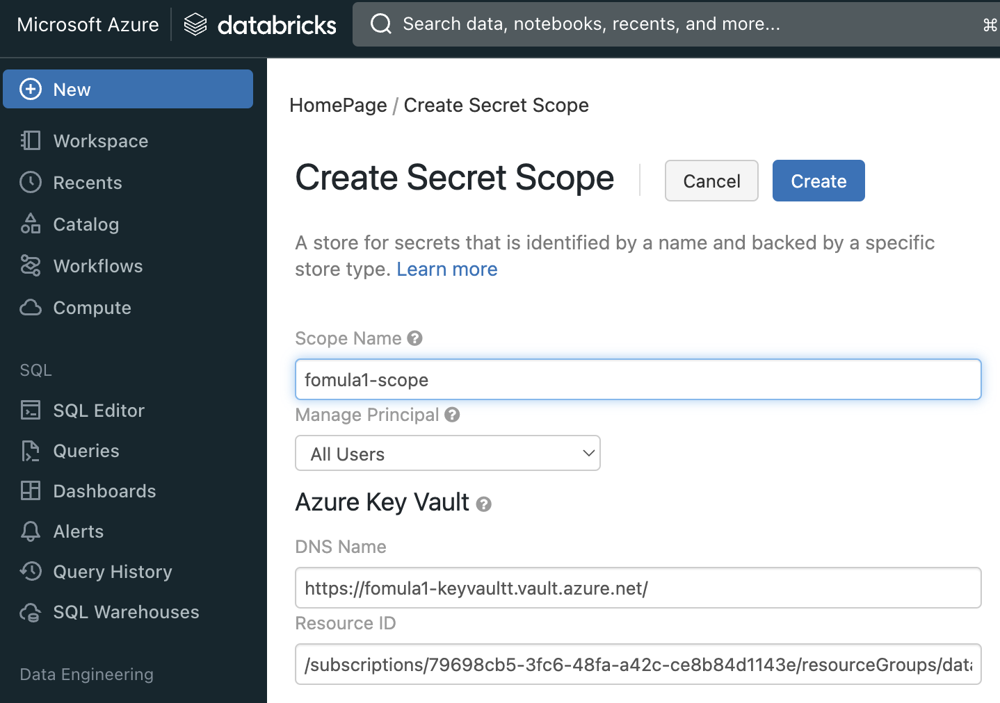
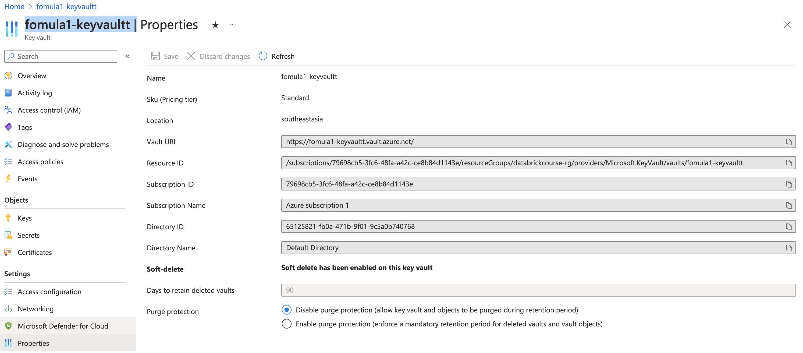

# Secure Access to Azure Data Lake
## 1. Create Azure Key Vault

```markdown
// Basics
Resource group: databrickcourse-rg
Key vault name: fomula1-key-vault-course
Region: Southeast Asia
Pricing tier: Standard

// Access configuration
Permission model: Vault access policy
```

Create access token in Key Vault


## 2. Create secret scope in Databrick
will get scope-name

Reference: https://learn.microsoft.com/en-us/azure/databricks/security/secrets/secret-scopes#create-an-azure-key-vault-backed-secret-scope-using-the-ui:~:text=all%20networks.-,Create%20an%20Azure%20Key%20Vault%2Dbacked%20secret%20scope%20using%20the%20UI,-Go%20to%20https

Go to `https://<databricks-instance>#secrets/createScope`. This URL is case sensitive; scope in createScope must be uppercase.


For `DNS Name` & `Resource ID`, go to key vault / Properties to get value for that
```markdown
DNS Name = Vault URI
Resource ID = Resource ID
```

